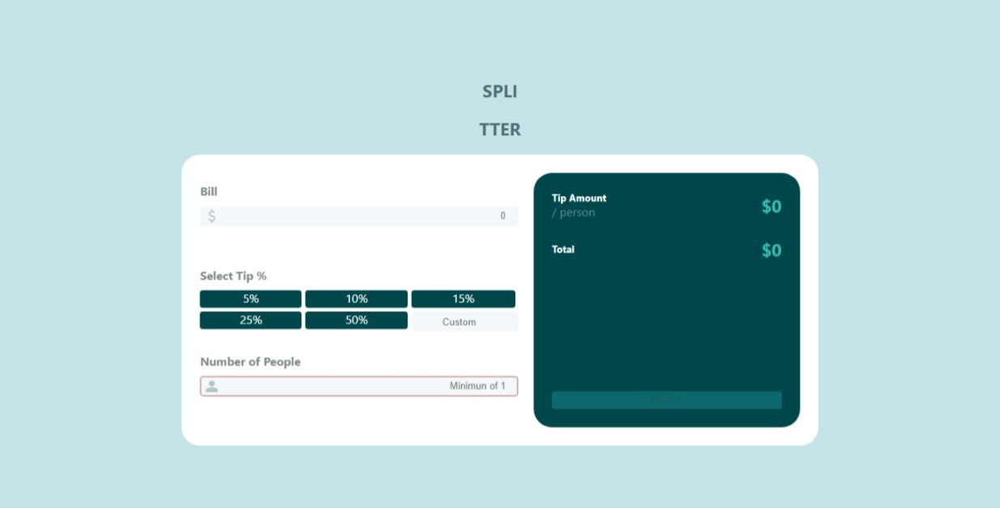

# Frontend Mentor - Tip calculator app solution

This is a solution to the [Tip calculator app challenge on Frontend Mentor](https://www.frontendmentor.io/challenges/tip-calculator-app-ugJNGbJUX).

## Table of contents

- [Overview](#overview)
  - [The challenge](#the-challenge)
  - [Screenshot](#screenshot)
  - [Video](#video)
  - [Links](#links)
- [My process](#my-process)
  - [Built with](#built-with)
  - [What I learned](#what-i-learned)
  - [Continued development](#continued-development)
- [Author](#author)

# Overview

## The challenge

Users should be able to:

- View the optimal layout for the app depending on their device's screen size.
- See hover states for all interactive elements on the page.
- Calculate the correct tip and total cost of the bill person.

## Screenshot



## Video

https://user-images.githubusercontent.com/106124660/195153444-1d75239a-1b07-4879-84ab-406633790702.mp4

### Links

- Solution URL: [GitHub](https://github.com/im-victor-mendez/React-Tip_Calculator)
- Live Site URL: [Netlify](https://storied-bombolone-54aefb.netlify.app/)

## My process

### Built with

- React JS
- Redux
- JavaScript
- Semantic HTML5 markup
- In process to add animations with Framer Motion 💕.
- SCSS custom properties
- [React](https://reactjs.org/) - JS library

### What I learned

- How to use Redux store.
- Inputs type radio behaviour.
- Link elements in SCSS
  ```scss
  .className0 ~ .className1 {
    ...
  }
  ```

**Note: If you want more help with writing markdown, we'd recommend checking out [The Markdown Guide](https://www.markdownguide.org/) to learn more.**

### Continued development

Pending to add @media to mobile sizes.

## Author

- [LinkedIn](https://www.linkedin.com/in/im-victor-mendez/)
- Frontend Mentor - [@im-victor-mendez](https://www.frontendmentor.io/profile/im-victor-mendez)
